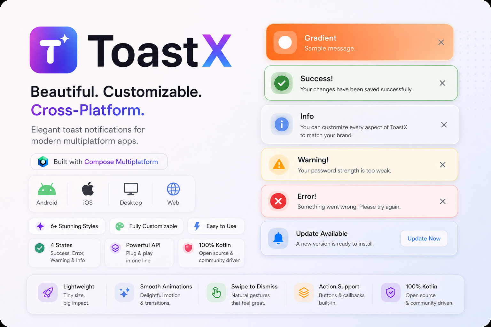

<p align="center">
  
</p>

<p align="center">
  <strong>Beautiful, customizable toast notifications for every platform.</strong>
</p>

<p align="center">
  Compose Multiplatform · Android · iOS · Desktop (JVM) · Web (JS &amp; Wasm)
</p>

---

**ToastX** is a Kotlin Multiplatform UI library for **Material 3–style toasts**: semantic types, multiple visual styles, swipe-to-dismiss, optional actions, theming, and smooth enter/exit motion. Show feedback in **one line** from shared `commonMain` code while a single **`ToastHost`** renders the overlay on each platform.

## Toast types (4)

Toasts are categorized by **`ToastType`**, which drives colors, icon treatment, and default timing:

| Type | Typical use |
|------|-------------|
| **`Success`** | Completed actions, saved state, positive confirmation |
| **`Error`** | Failures, validation errors, blocked operations |
| **`Warning`** | Risky actions, deprecations, recoverable issues |
| **`Info`** | Neutral tips, background status, non-blocking notices |

Convenience APIs: `ToastX.success`, `ToastX.error`, `ToastX.warning`, `ToastX.info`, plus `ToastX.show(..., type = …)` and `ToastX.custom(ToastConfig(…))` for full control (custom icons, actions, **`durationSec`** in whole seconds, position).

## Visual styles (9+)

**`ToastStyle`** selects the layout family (cards, outlines, gradients, glass, bottom-sheet strip, and more). The banner highlights **6+** curated styles; the library currently ships **nine** `ToastStyle` variants (for example **Soft**, **Minimal**, **Outline**, **Elevated**, **OuterShadow**, **BottomSheet**, **Gradient**, **AnimatedBorder**, **Glass**). Pass `style = ToastStyle.…` on any `ToastX` call or inside `ToastConfig`.

## Requirements

- **Kotlin** and **Compose Multiplatform** aligned with this repo (see [`gradle/libs.versions.toml`](gradle/libs.versions.toml)).
- **Android** `minSdk` **24** (library modules).
- **Coroutines** (used by `ToastManager` for auto-dismiss).

## Install

ToastX is published to **Maven Central** as a single Kotlin Multiplatform artifact.

| |                                                                                                            |
|--|------------------------------------------------------------------------------------------------------------|
| **Group** | `io.github.maulikdadhaniya`                                                                                |
| **Artifact** | `toastx`                                                                                                   |
| **Version** | `1.0.1` (see [Releases](https://github.com/maulikdadhaniya/ToastX/releases) or Central for newer versions) |

Maven coordinate string: **`io.github.maulikdadhaniya:toastx:1.0.1`**

Ensure **`mavenCentral()`** is in your `dependencyResolutionManagement` / `repositories` block.

### Gradle (Kotlin Multiplatform)

**`build.gradle.kts`**

```kotlin
kotlin {
    sourceSets {
        commonMain.dependencies {
            implementation("io.github.maulikdadhaniya:toastx:1.0.1")
        }
    }
}
```

One dependency includes **`ToastX`**, **`ToastHost`**, **`ToastConfig`**, and all UI internals.

### Match Compose compiler and Material 3

Use a **Compose Multiplatform** and **Compose compiler** setup compatible with your Kotlin version (same idea as this repo’s [`composeApp/build.gradle.kts`](composeApp/build.gradle.kts) and [`gradle/libs.versions.toml`](gradle/libs.versions.toml)).

### From source (optional)

To depend on a **local checkout** instead of Central, include the library module (**`:toastxLib`**, folder `toastx-core/`):

**`settings.gradle.kts`**

```kotlin
include(":app")
include(":toastxLib")
project(":toastxLib").projectDir = file("../ToastX/toastx-core")
```

**`build.gradle.kts`**

```kotlin
kotlin {
    sourceSets {
        commonMain.dependencies {
            implementation(project(":toastxLib"))
        }
    }
}
```

## Usage

### Host (required once)

Wrap your root UI so overlays and theme tokens resolve correctly. **`ToastHost`** subscribes to **`ToastManager`** and animates the current toast.

```kotlin
import androidx.compose.material3.MaterialTheme
import androidx.compose.material3.darkColorScheme
import androidx.compose.material3.lightColorScheme
import androidx.compose.runtime.Composable
import androidx.compose.runtime.getValue
import androidx.compose.runtime.mutableStateOf
import androidx.compose.runtime.remember
import androidx.compose.runtime.setValue
import com.maulik.toastx.ToastPosition
import com.maulik.toastx.ToastStyle
import com.maulik.toastx.ToastX
import com.maulik.toastx.theme.ToastThemeDefaults
import com.maulik.toastx.ui.ToastHost

@Composable
fun App() {
    var dark by remember { mutableStateOf(false) }
    val colors = if (dark) darkColorScheme() else lightColorScheme()

    ToastHost(
        lightTheme = ToastThemeDefaults.light,
        darkTheme = ToastThemeDefaults.dark,
        useDarkTheme = dark,
        position = ToastPosition.TopCenter,
    ) {
        MaterialTheme(colorScheme = colors) {
            // Your screens — buttons, forms, ViewModels, etc.
            // ToastX.success(message = "Saved")
        }
    }
}
```

### Show toasts

From any composable or callback **after** the host is in the tree:

```kotlin
import com.maulik.toastx.ToastType

ToastX.success(message = "Profile updated", title = "Success")
ToastX.error(message = "Could not connect", title = "Error")
ToastX.warning(message = "Session ends in 5 minutes", title = "Warning")
ToastX.info(message = "Tip: swipe the toast to dismiss", title = "Info")

ToastX.show(
    title = "Headline",
    message = "Body text",
    type = ToastType.Info,
    style = ToastStyle.Glass,
    position = ToastPosition.BottomCenter,
    showClose = true,
    durationSec = 4,
)
```

Custom layout (icons, actions, `onDismiss`):

```kotlin
ToastX.custom(
    ToastConfig(
        title = "Backup complete",
        message = "Your data is safe.",
        type = ToastType.Success,
        style = ToastStyle.Elevated,
        showClose = true,
        action = ToastAction(label = "Undo") { /* … */ },
        onDismiss = { /* … */ },
    ),
)
```

Swipe-to-dismiss and safe-area padding are handled inside **`ToastHost`** (see [`ToastRenderer`](toastx-core/src/commonMain/kotlin/com/maulik/toastx/ui/ToastRenderer.kt)).

## Sample app

The **`composeApp`** module in this repository is a runnable **Compose Multiplatform** sample (login flow with **Lottie** icons in toasts). Use it as a reference for wiring **`ToastHost`**, **`ToastX.custom`**, and shared resources.

## Developing this repository

### Android

```shell
./gradlew :composeApp:assembleDebug
```

### Desktop (JVM)

```shell
./gradlew :composeApp:run
```

### Web (Wasm, modern browsers)

```shell
./gradlew :composeApp:wasmJsBrowserDevelopmentRun
```

### Web (JS)

```shell
./gradlew :composeApp:jsBrowserDevelopmentRun
```

### iOS

Open [`iosApp`](iosApp) in Xcode or use the IDE run configuration for the iOS target.

---

Learn more about [Kotlin Multiplatform](https://www.jetbrains.com/help/kotlin-multiplatform-dev/get-started.html), [Compose Multiplatform](https://github.com/JetBrains/compose-multiplatform), and [Kotlin/Wasm](https://kotl.in/wasm/).
