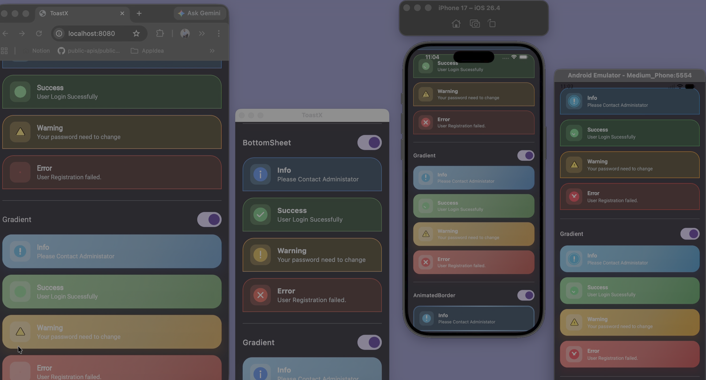

<p align="center">
  
</p>

<p align="center"><strong>Toast notifications for Compose Multiplatform</strong> · Android · iOS · Desktop · Web (JS &amp; Wasm)</p>

---

**ToastX** shows Material-style toasts from shared Kotlin code. You add **one** `ToastHost` at the root, then call **`ToastX`** from anywhere under it.

<p align="center">
  
</p>

## What you need

- A **Kotlin Multiplatform** module with **Compose Multiplatform** (and the **Compose compiler** plugin for your Kotlin version).
- **`mavenCentral()`** in Gradle repositories.
- **Android `minSdk` 24** if you ship Android.
- **Coroutines** (ToastX uses them for auto-dismiss).

## Add the library

**Maven:** `io.github.maulikdadhaniya:toastx:1.0.2` — see [Releases](https://github.com/maulikdadhaniya/ToastX/releases) for newer versions.

In your shared **`build.gradle.kts`**, inside `kotlin { sourceSets { commonMain.dependencies { … } } }`:

```kotlin
implementation("io.github.maulikdadhaniya:toastx:1.0.2")
```

You also need Compose **runtime**, **foundation**, **material3**, and **ui** on `commonMain` (same as any Compose Multiplatform UI).

## Configure: host + show

**1. Wrap your app once** with `ToastHost` (theme + position + overlay). Put your real UI inside the trailing lambda.

```kotlin
import androidx.compose.material3.MaterialTheme
import androidx.compose.material3.darkColorScheme
import androidx.compose.material3.lightColorScheme
import androidx.compose.runtime.Composable
import androidx.compose.runtime.getValue
import androidx.compose.runtime.mutableStateOf
import androidx.compose.runtime.remember
import androidx.compose.runtime.setValue
import com.maulik.toastx.ToastPosition
import com.maulik.toastx.ToastX
import com.maulik.toastx.theme.ToastThemeDefaults
import com.maulik.toastx.ui.ToastHost

@Composable
fun App() {
    var dark by remember { mutableStateOf(false) }
    val colors = if (dark) darkColorScheme() else lightColorScheme()

    ToastHost(
        lightTheme = ToastThemeDefaults.light,
        darkTheme = ToastThemeDefaults.dark,
        useDarkTheme = dark,
        position = ToastPosition.BottomCenter,
    ) {
        MaterialTheme(colorScheme = colors) {
            // Your screens — call ToastX from here or from child composables
        }
    }
}
```

**2. Show a toast** after the host exists (from any composable under `ToastHost`):

```kotlin
ToastX.success(title = "Done", message = "Saved.")
ToastX.error(title = "Error", message = "Something went wrong.")
ToastX.warning(title = "Heads up", message = "Check this.")
ToastX.info(title = "Info", message = "Details here.")
```

**3. More control** (style, duration in seconds, button, custom icon): use **`ToastX.custom(ToastConfig(…))`**. Set **`style = ToastStyle.…`**, **`durationSec`**, **`action`**, and optionally **`iconContent`** (a `@Composable (ToastType) -> Unit` for the left slot — or leave it `null` for the built-in icon).

## Types and looks (short)

- **`ToastType`**: `Success`, `Error`, `Warning`, `Info` — drives color and default icon.
- **`ToastStyle`**: `Soft`, `Minimal`, `Outline`, `Elevated`, `OuterShadow`, `BottomSheet`, `Gradient`, `AnimatedBorder`, `Glass` — changes the card layout.

API reference: run `./gradlew :toastxLib:dokkaGenerate`, then open `toastx-core/build/dokka/html/index.html` in a browser.

## Sample in this repo

The **`composeApp`** module is a small runnable app (style previews + sign-in) you can copy from.

---

[Kotlin Multiplatform](https://www.jetbrains.com/help/kotlin-multiplatform-dev/get-started.html) · [Compose Multiplatform](https://github.com/JetBrains/compose-multiplatform)
